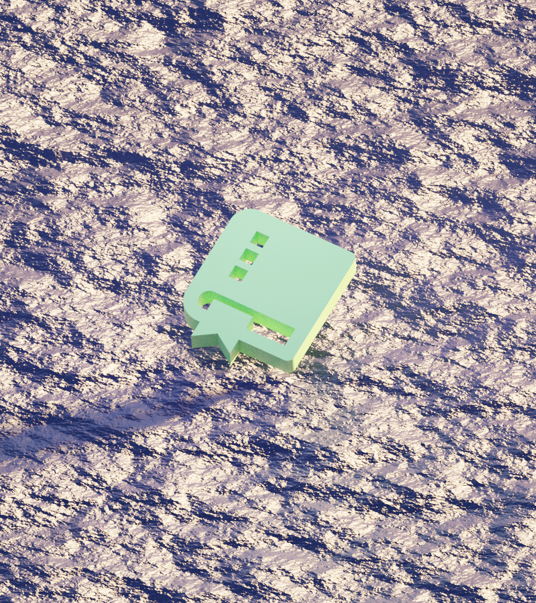

# Implementing native GIF saving in p5.js

#### Jesús Enrique Cartas Rascón — March 25th, 2023

---

# Who are you again?

- It's Jesús here! Digitally known as @jesi_rgb mostly everywhere.

- I am a designer, web developer, animator and musician! All things art, but make it digital.

- So far, I've mainly done mathematical animation and web design.

---

# So, GIFs

## What?

- _Very_ old format
- Palette based
- Lossless image compression format
- Lighter, video like (sometimes)
- Pronounced like /GIF/

---

# So, GIFs

## Why?

- Excellent meme format
- Excellent WIP sharing format
- True and tested, supported mostly everywhere
- Everyone is familiar with it
- Most webpages are comfortable with it

---

# So, GIFs

## How?

We will develop a system that fits into the p5.js ecosystem, allowing users to very easily save gifs out of their sketches.

- **Bucket list**:
  - Fast, as fast as possible
  - Very easy to use
  - Feels native to the platform
  - Somewhat reliable
  - Responsive
    - _Please, do not freeze my computer_
  - Small file size
    - Twitter's file limit is 15MB

---

# So, GIFs

## How?

A bird's eye view:

- Gather every **frame** from your animation

- Generate a global **palette**

- **Apply** the palette to every frame

- Smash **holes** wherever applies

- **Encode** each frame

- Enjoy! 🥳 🎉

---

# Frame Gathering

- Save a frame every _n_ milliseconds?
  - Some sketches will run slower, if running very intensive animations
  - The `frameRate` won't be consistent throughout the animation

### We need to _wait_ for the frame to finish and immediately save it

---

# Global Palette Generation

<!-- GIF or image of an ancient book "the gif specs" -->

## Why?

In order to build any given GIF file, we must comply with the GIF specs. And specs tell us that we must use a maximum of 256 colors.

---

# Global Palette Generation

<!-- top: general purpose palette from insouris, bottom: a similar looking "custom" palette matching our theme -->

We can use a default one that has a mediocre representation of _all_ colors, or we can generate one ourselves.

It is not _that_ hard and yields much better results.

---

# Global Palette Generation

<!-- top: a grid of "16M" squares representing all the colors, down: a very small palette of 8x8 colors representing our final space -->

## How?

### ✨**Color Quantization**✨

We want to shrink the usual 8-bit colorspace of 16M+ colors into just(!) 256. Thats a 0,0016% of the total.

---

# Global Palette Generation

## ✨**Color Quantization**✨

Basic steps:

- Subdivide the original color space into chunks.
- Get the desired pixel color values and find the chunk it belongs in.
- Substitute that color for the chunk's representing color.

For excruciating details, you may check out [my blogpost](https://www.jesirgb.com/blog/gif-encoding), in which I covered this in great detail.

---

# Global Palette Generation

<!-- similar composition as before. top is a ton of chunks being selected and arrows coming from them, that go to bottom, in which they are ordered  -->

Now that we _know_ how color quantization works, we can actually generate our palette.

The main idea is to shrink the color space in order to find what regions (or chunks) are more popular amongst the pixels in our image.

For that, we make a ranking of the most frequent chunks as they appear in our images and simply take the 256 best.

---

# Applying a palette

<!-- copy image from blogpost  -->

The most difficult part was generating a palette. Now, it all comes down to applying it.

To _apply a palette_ means to take the original pixels in each frame and substitute them for their closest version within the palette.

---

# Important optionals

<!-- copy image from blogpost  -->

## ✨Transparency optimization✨

At this point we could be done. But this is a technique that could greatly help in file size.

- We analyze each frame before encoding it and find what's similar.
- We mark everything that is redundant from one frame to the next. That is, pixels have the same values.
- By marking them, we can tell the gif encoder to simply treat these as transparent, allowing us to _see through_ this frame in to the previous one.

---

# Summing up

