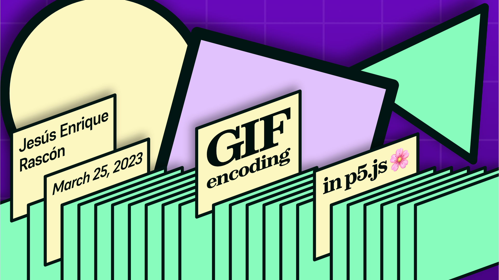
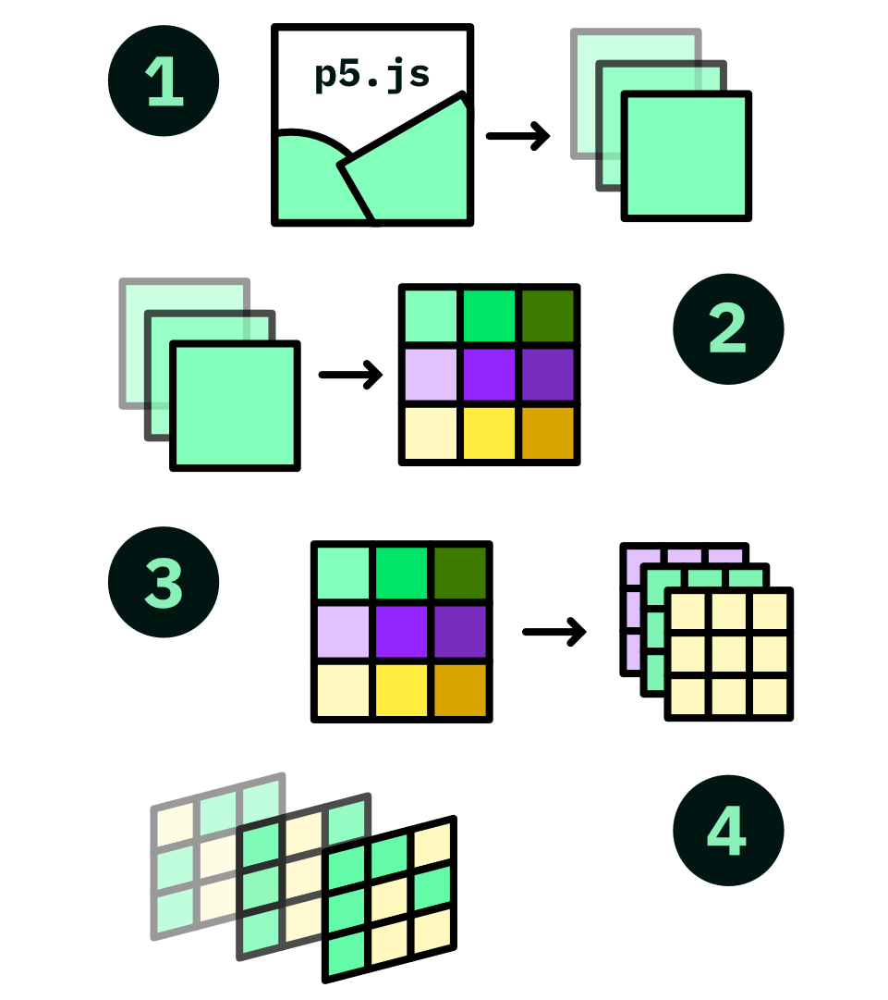
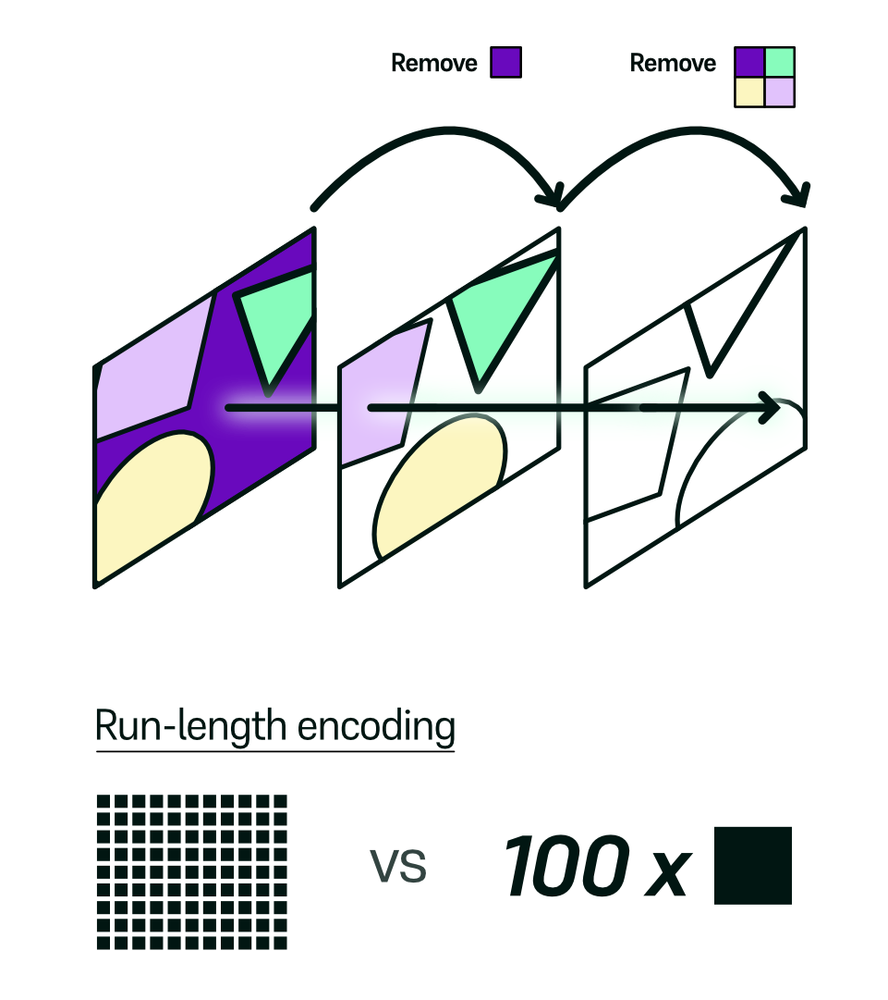

---

# Who are you again?

- It's Jesús here! Digitally known as @jesi_rgb mostly everywhere.

- I am a designer, web developer, animator and musician! All things art, but make it digital.

- So far, I've mainly done mathematical animation and web design.

---

# The solution

 
 
 
 
 
 
<a href="https://openprocessing.org/sketch/1872458" style="opacity:0;">
<h1>
aaaaaaaaaaaaaaa
</h1>

</a>

---

# So, GIFs

## What?

- _Very_ old format
- Palette based
- Lossless image compression format
- Lighter, video like (sometimes)
- Pronounced like /GIF/

---

# So, GIFs

## Why?

- Excellent meme format
- Excellent WIP sharing format
- True and tested, supported mostly everywhere
- Everyone is familiar with it
- Most webpages are comfortable with it

---

# So, GIFs

## How?

We will develop a tool that fits into the p5.js ecosystem, allowing users to very easily save gifs out of their sketches.

- **Bucket list**:
  - Fast, as fast as possible
  - Very easy to use
  - Feels native to the platform
  - Somewhat reliable
  - Responsive
    - _Please, do not freeze my computer_
  - Small file size
    - Twitter's file limit is 15MB

---

# A 🐦's 👀 view

- Gather every **frame** from your animation

- Generate a global **palette**

- **Apply** the palette to every frame

- Smash **holes** wherever applies

- **Encode** each frame

- Enjoy! 🥳 🎉

---

# Frame Gathering

- Save a frame every _n_ milliseconds?
  - Some sketches will run slower, if running very intensive animations
  - The `frameRate` won't be consistent throughout the animation

### We need to _wait_ for the frame to finish and immediately save it

---

# Global Palette Generation

In order to build any given GIF file, we must **comply** with the GIF specs. And the specs tell us to build a palette that every frame needs to reference, whether it is local or global.

This palette must contain 256 _(!)_ colors.

We can make _local_ palettes, but that's wasteful.

We'll make a **global** palette instead.

---

# Global Palette Generation

<!-- top: general purpose palette from insouris, bottom: a similar looking "custom" palette matching our theme -->

We can use the default one that has a **mediocre** representation of _all_ colors, or we can generate one ourselves.

It is not _that_ hard and yields much better results.

---

# Global Palette Generation

- Make a list of all the **unique colors** present in every frame; that is, every color that will appear in our animation
- **Sort them by frequency**; that is, how much they appear in our animation
  - Background colors, for example, appear a lot (basically always!)
- Finally, take the **255' most important colors!**

For excruciating details, you may check out [my blogpost](https://www.jesirgb.com/blog/gif-encoding), in which I covered this in great detail.

---

# Applying a palette

<!-- copy image from blogpost  -->

The most difficult part was generating a palette. Now, it all comes down to applying it.

To _apply a palette_ means to take the original pixels in each frame and substitute them for their **closest version** within the palette.

To find how _close_ two colors are, we can use the **euclidean distance**, for example.

---

# Transparency Optimization

<!-- copy image from blogpost  -->

At this point we could be done. But this is a technique that could greatly help in file size.

- We analyze each **pair of frames** before encoding and find what's similar.
- We mark everything that is redundant from one frame to the next. That is, pixels that have the same values.
- By marking them, we can tell the gif encoder to simply treat these as transparent, allowing us to _see through_ this frame in to the previous one.

---

# Summing up

### Goals

<!-- mention that this feature is allowing newcomers to much more easily share stuff, and that this was one of the main purposes of the project altogether. how can this improve accessibility?  -->

- Given any sketch, we can successfully render GIFs easily, quickly and conveniently.
- No need to hook up external libraries. These can feel intimidating for newcomers.
  - _Sometimes those even feel intimidating to me_
- File size is relatively small and render times are not too long!
  - Also, some progress is shown for proper user feedback

---

# Thanks much!

- Special thanks to **Divyanshu Raj**, **Dave Pagurek** and **Matt DesLauriers** for their continued support and invaluable feedback and help!
- And massive props to the Processing Foundation for making this possible and accessible to everyone.

### and, last but not least... thank YOU!

Find me at:

- Webpage: [jesirgb.com](https://jesirgb.com)
- Twitter: [@jesi_rgb](https://twitter.com/jesi_rgb)
- Github: [jesi-rgb](https://github.com/jesi-rgb)
- Mastodon: [@jesi_rgb](https://mastodon.social/@jesi_rgb)
