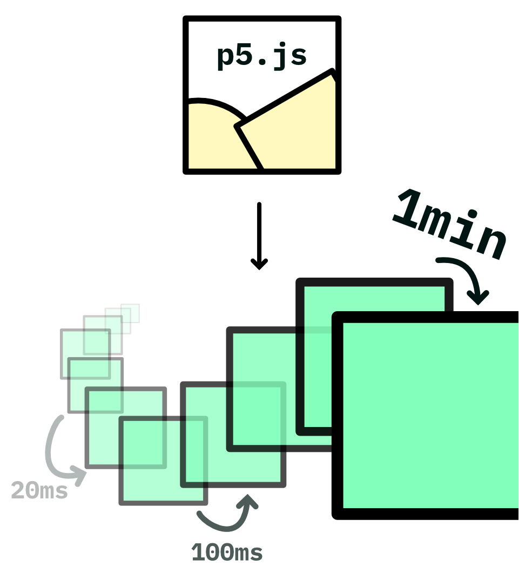

<!-- - show failing stuff or edge cases -->
<!-- - talk about the actual problem -->
<!--   - the function was not there and was necessary for people -->
<!-- - show a demo (beginning? end?) -->
<!--   - show how I was done before -->
<!--   - show CCapture -->

# GIF encoding in p5.js 🌸

#### Jesús Enrique Cartas Rascón — March 25th, 2023

---

# Who are you again?

- It's Jesús here! Digitally known as @jesi_rgb mostly everywhere.

- I am a designer, web developer, animator and musician! All things art, but make it digital.

- So far, I've mainly done mathematical animation and web design.

---

# The solution

<!-- here goes maybe link to demo? -->

---

# So, GIFs

## What?

- _Very_ old format
- Palette based
- Lossless image compression format
- Lighter, video like (sometimes)
- Pronounced like /GIF/

---

# So, GIFs

## Why?

- Excellent meme format
- Excellent WIP sharing format
- True and tested, supported mostly everywhere
- Everyone is familiar with it
- Most webpages are comfortable with it

---

# So, GIFs

## How?

We will develop a system that fits into the p5.js ecosystem, allowing users to very easily save gifs out of their sketches.

- **Bucket list**:
  - Fast, as fast as possible
  - Very easy to use
  - Feels native to the platform
  - Somewhat reliable
  - Responsive
    - _Please, do not freeze my computer_
  - Small file size
    - Twitter's file limit is 15MB

---

# So, GIFs

## How?

A bird's eye view:

- Gather every **frame** from your animation

- Generate a global **palette**

- **Apply** the palette to every frame

- Smash **holes** wherever applies

- **Encode** each frame

- Enjoy! 🥳 🎉

---

# Frame Gathering

- Save a frame every _n_ milliseconds?
  - Some sketches will run slower, if running very intensive animations
  - The `frameRate` won't be consistent throughout the animation

### We need to _wait_ for the frame to finish and immediately save it

---

# Global Palette Generation

<!-- GIF or image of an ancient book "the gif specs" -->

## Why?

In order to build any given GIF file, we must comply with the GIF specs. And the specs tell us to build a palette that everyframe needs to reference, whether they're local or global.

We can make _local_ palettes, but that's wasteful.

We'll make a **global** palette instead.

---

# Global Palette Generation

<!-- top: general purpose palette from insouris, bottom: a similar looking "custom" palette matching our theme -->

We can use the default one that has a mediocre representation of _all_ colors, or we can generate one ourselves.

It is not _that_ hard and yields much better results.

---

# Global Palette Generation

- Make a list of all the **unique colors** present in every frame; that is, every color that will appear in our animation
- **Sort them by frequency**; that is, how much they appear in our animation
  - Background colors, for example, appear a lot (basically always!)
- Finally, take the **255' most important colors!**

For excruciating details, you may check out [my blogpost](https://www.jesirgb.com/blog/gif-encoding), in which I covered this in great detail.

---

# Applying a palette

<!-- copy image from blogpost  -->

The most difficult part was generating a palette. Now, it all comes down to applying it.

To _apply a palette_ means to take the original pixels in each frame and substitute them for their **closest version** within the palette.

To find how _close_ two colors are, we can use the **euclidean distance**, for example.

---

# Important optionals

<!-- copy image from blogpost  -->

## ✨Transparency optimization✨

At this point we could be done. But this is a technique that could greatly help in file size.

- We analyze each frame before encoding it and find what's similar.
- We mark everything that is redundant from one frame to the next. That is, pixels have the same values.
- By marking them, we can tell the gif encoder to simply treat these as transparent, allowing us to _see through_ this frame in to the previous one.

---

# Summing up

